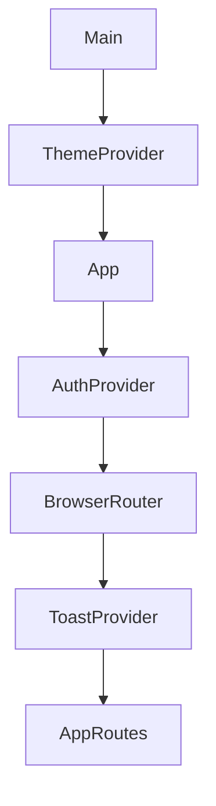
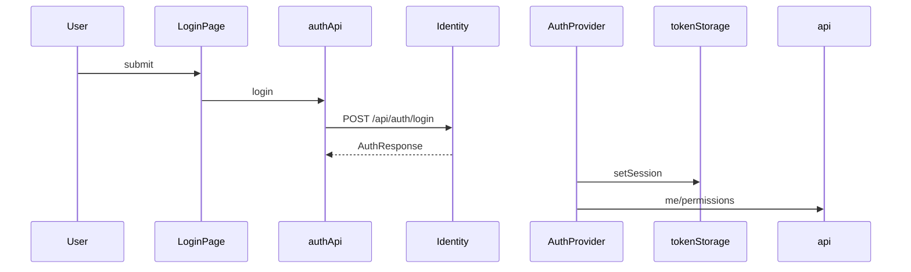
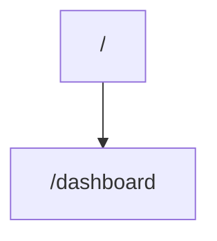
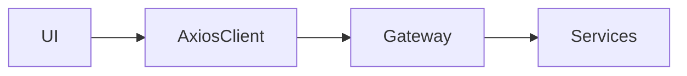
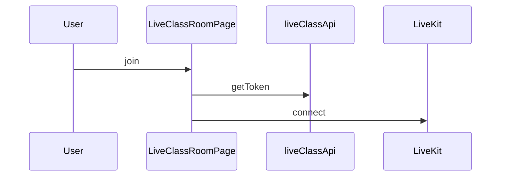

# Mermaid Architecture

## Component Hierarchy

```mermaid
graph TD
  Main --> ThemeProvider --> App --> AuthProvider --> BrowserRouter --> ToastProvider --> AppRoutes
```

## Auth Sequence

```mermaid
sequenceDiagram
  User->>LoginPage: submit
  LoginPage->>authApi: login
  authApi->>Identity: POST /api/auth/login
  Identity-->>authApi: AuthResponse
  AuthProvider->>tokenStorage: setSession
  AuthProvider->>api: me/permissions
```

## Route Navigation

```mermaid
graph TD
  Root["/"] --> Dashboard["/dashboard"]
```

## API Communication

```mermaid
graph LR
  UI --> AxiosClient --> Gateway --> Services
```

## Live Classroom Connection

```mermaid
sequenceDiagram
  User->>LiveClassRoomPage: join
  LiveClassRoomPage->>liveClassApi: getToken
  LiveClassRoomPage->>LiveKit: connect
```
